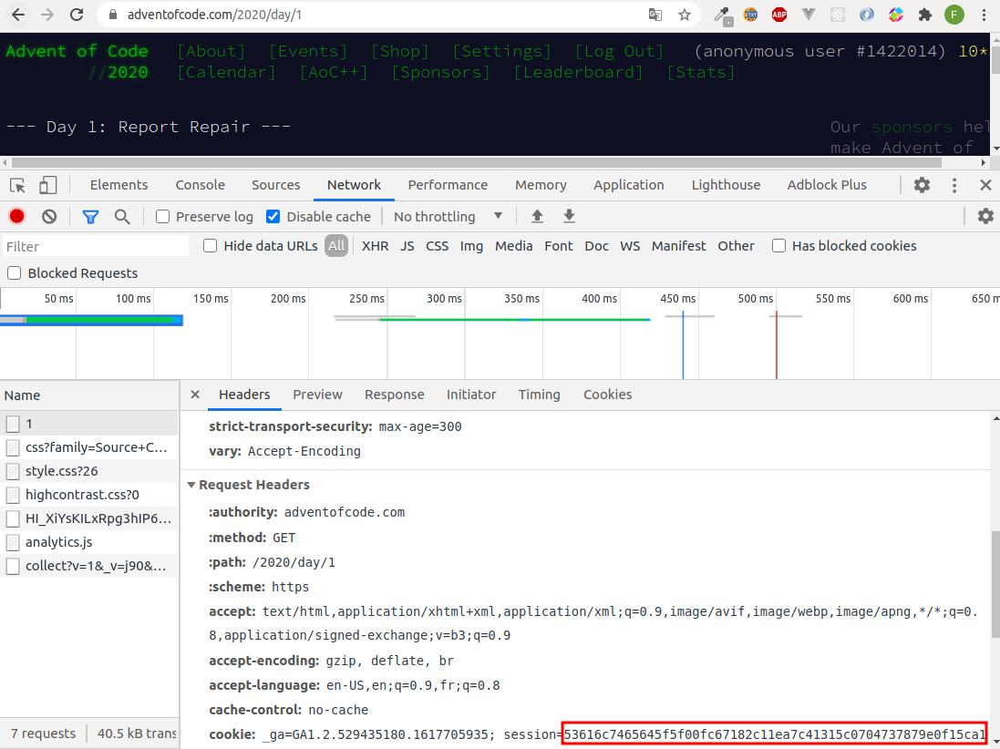

# Tips

The pre-requisite is to have rust installed with `rustup`.

src/puzzle.rs is a way to download new challenge inputs to the `inputs` directory (then they're fetched from disk). You'll need a proper .env variable called `SESSION=`, that you can retrieve the session value in HTTP headers from a browser introspection into an authenticated request to `adventofcode.com`.

Otherwise you'll get a panic when running `cargo run`:
`thread main panicked at called Result::unwrap() on an Err value: Missing session variable'`

If you need to start a new challenge:

- create a new dayXX.rs file in repo aocYYYY, from the template dayXX-template.rs
- declare your module in aocYYYY/mod.rs
- change main.rs to start your challenge
- implement dayXX.rs to solve the challenge
- run `cargo run`
- (optional) implement your tests locally
- check your solution on `adventofcode.com/day/X`

# Notes

- `#![allow(dead_code)]` is used to avoid warnings for past challenges
- you may need updates in cargo.toml if you need an additional dependency
- I use rust analyzer within visual studio, and as a linter
